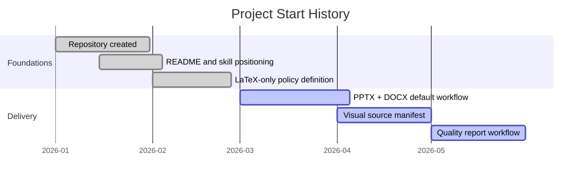
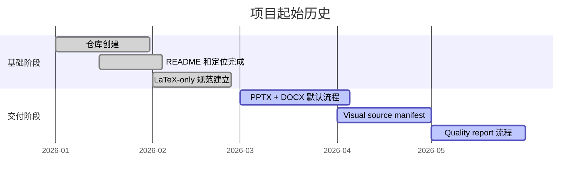

# AI Paper2Slide Skill
**Conference-Grade Paper-to-Slide Generation for AI Research**

<p align="center">
  <b>Turn AI research papers into polished conference presentations with LaTeX-only slide images, default PPTX + English DOCX delivery, and top-tier AI conference style.</b>
</p>

<p align="center">
  <a href="#english"></a>
  <a href="#中文"></a>
  <a href="LICENSE"></a>
  
  
  
  
</p>

---

## English

## Overview

`ai-paper2slide-skill` is an open-source ChatGPT Skill for converting AI and scientific papers into **conference-quality slide packages**.

It is designed for papers submitted to or presented at top-tier venues such as **NeurIPS, ICML, ICLR, CVPR, ACL, KDD, WWW, AAAI, SIGIR, EMNLP, ECCV, ICCV, MICCAI**, and related AI, machine learning, and computer vision conferences.

Unlike generic document-to-slide tools, this Skill focuses on two strict production guarantees:

1. **LaTeX-only slide images**  
   Any image inserted into the slide deck must come from the user-provided LaTeX source package. The Skill does not use PDF screenshots, web images, generated images, previous-conversation images, or external substitutes.

2. **Default two-file delivery**  
   Every full paper-to-slide run returns at least two user-facing files by default: a `.pptx` slide deck and a `.docx` English per-slide speaker script.

The Skill also generates a visual source manifest and quality report whenever possible, so architecture diagrams, method figures, main result tables, ablations, and qualitative examples remain traceable to the source paper.

---

## Key Features

### LaTeX-only visual provenance

The Skill prioritizes the original LaTeX source package and scans it for:

- `\includegraphics` paths
- figure and table environments
- captions
- labels
- surrounding explanatory text
- architecture and method diagrams
- experimental result tables
- ablation and qualitative visualizations

Only visual assets found inside the user-provided LaTeX package are eligible for slide images.

Disallowed slide image sources include:

- PDF page screenshots or crops
- images from the web
- generated images
- stock icons or decorative assets
- images from previous conversations
- images from other papers or project pages
- user-uploaded images outside the LaTeX package

If a needed figure cannot be resolved from the LaTeX package, the Skill should not insert a substitute image. Instead, it creates a clean text/shape-based explanatory slide and records the unresolved source in the quality report.

---

### Default PPTX + English DOCX output

For every full paper-to-slide request, the Skill produces by default:

| Output File | Required | Description |
|---|---:|---|
| `paper2slide_deck.pptx` | Yes | A 16:9 PowerPoint presentation for the paper |
| `paper2slide_speaker_script.docx` | Yes | English per-slide speaking script, approximately 10 minutes total by default |
| `visual_source_manifest.json` | Recommended | Source trace of figures and tables from the LaTeX package |
| `paper2slide_quality_report.md` | Recommended | Checks for LaTeX-only image compliance, visual-source accuracy, slide readability, and script timing |

The PPTX and English DOCX are mandatory default deliverables. The Skill should not return only an outline, markdown draft, screenshot set, or planning notes when a full paper-to-slide package is requested.

---

### Conference-ready slide design

The Skill guides ChatGPT to create a clean, presentation-ready `.pptx` deck with:

- 16:9 widescreen layout
- claim-based slide titles
- sparse and readable text
- source-grounded architecture and result visuals
- strong method storytelling
- clear experiment and ablation slides
- final takeaway and impact slide

The visual style is inspired by real AI conference presentations: minimal, evidence-driven, readable, and free from generic business-template language.

---

### Configurable presentation language

The default speaker script is **English**, because it is the standard format for most international AI conference presentations.

Users may still request different language modes for slide text, notes, or additional scripts:

| Mode | Description |
|---|---|
| `English` | Default mode for international AI conference talks |
| `Chinese` | Suitable for Chinese group meetings, thesis defenses, and internal research reports |
| `Bilingual` | Commonly used for English slide titles with Chinese explanations, or Chinese slides with English technical terms |
| `Custom language` | Any user-specified language depending on the venue or audience |

Recommended behavior: keep `paper2slide_speaker_script.docx` as the default English script. If the user requests Chinese or bilingual materials, return additional language-specific files when appropriate.

Example language requests:

```text
Generate the slides in English and the speaker script in Chinese as an extra file.
```

```text
Create a bilingual version: English slide titles and Chinese speaker notes, while also keeping the default English speaker script.
```

```text
Prepare the full presentation in Chinese for a group meeting, and also provide the default English per-slide script.
```

---

## Recommended Input

For best accuracy, provide both:

1. **Original LaTeX source package**  
   Supported formats: `.zip`, `.tar`, `.tar.gz`

2. **Compiled paper PDF**  
   Used for text cross-checking, section order, and final paper layout reference.

The LaTeX package is required if the deck should contain paper images. PDF-only input may be used for text understanding, but the Skill should not insert PDF-cropped figures or screenshots into the presentation.

---

## Example User Requests

### International conference talk

```text
Convert this LaTeX paper package into a 10-minute NeurIPS-style presentation.

Please create:
1. A 16:9 PowerPoint slide deck.
2. A Word document with the English per-slide speaking script.
3. A visual source manifest for all architecture figures and experimental result tables.
4. A quality report checking LaTeX-only image compliance, figure/table placement, and script timing.

Only use images that are included in the provided LaTeX package.
```

### Chinese group meeting

```text
请将这篇论文转换为一个 10 分钟中文组会汇报。

请生成：
1. 中文 PPT。
2. 默认英文逐页演讲稿 Word 文档。
3. 可选中文逐页演讲稿 Word 文档。
4. 图表来源 manifest 和质量报告。

Slide 中的所有图片必须只来自我上传的 LaTeX 源文件包。
```

### Bilingual research presentation

```text
Create a bilingual paper presentation.

Use English for slide titles and technical terms, write Chinese speaker notes as an additional file, and keep the default English per-slide speaker script.
The deck should follow a clean AI conference style and only use images from the LaTeX source package.
```

---

## Workflow

```text
LaTeX source package + optional PDF
        │
        ▼
Source inspection
        │
        ├── figure/table extraction
        ├── caption and label mapping
        ├── includegraphics asset resolution
        ├── LaTeX-only image eligibility check
        └── visual_source_manifest.json
        │
        ▼
Paper understanding
        │
        ├── problem and motivation
        ├── method and architecture
        ├── experiments and ablations
        ├── results and limitations
        └── contribution narrative
        │
        ▼
Slide planning
        │
        ├── 10-minute talk structure
        ├── claim-based slide titles
        ├── visual-to-slide mapping
        ├── English speaker-script timing
        └── per-slide key message
        │
        ▼
Artifact generation
        │
        ├── paper2slide_deck.pptx
        ├── paper2slide_speaker_script.docx
        ├── visual_source_manifest.json
        └── paper2slide_quality_report.md
```

---

## Start History

A minimal visualized project start history can help readers understand the scope and evolution of the skill.



---

## Included Helper Scripts

### `scripts/inspect_latex_assets.py`

Scans a LaTeX project or archive and creates a visual source manifest.

```bash
python scripts/inspect_latex_assets.py paper_source.zip \
  --output visual_source_manifest.json
```

The generated manifest helps identify:

- figure IDs
- table IDs
- source file paths
- captions
- labels
- LaTeX environments
- resolved image assets inside the LaTeX package
- likely architecture figures
- likely experimental result tables
- whether a figure is eligible to be used as a slide image

---

### `scripts/validate_visual_sources.py`

Checks whether a slide visual map only references valid figure and table IDs from the manifest.

```bash
python scripts/validate_visual_sources.py \
  visual_source_manifest.json \
  slide_visual_map.json \
  --strict-latex-images \
  --output paper2slide_quality_report.md
```

Strict mode verifies that figure images are source-anchored and backed by resolved LaTeX package assets.

---

## Suggested 10-Minute Talk Structure

| Section | Suggested Time | Purpose |
|---|---:|---|
| Title and motivation | 0.5-1 min | Introduce the problem and why it matters |
| Key challenge | 1 min | Explain the technical gap |
| Main idea | 1 min | Present the core insight |
| Method overview | 2 min | Explain the model architecture and pipeline |
| Main results | 2 min | Show quantitative improvements |
| Ablation and analysis | 1-1.5 min | Validate design choices |
| Qualitative examples | 1 min | Provide intuitive evidence, only if source assets exist |
| Conclusion | 0.5 min | Summarize contributions and impact |

The exact structure can be adapted for oral presentation, spotlight, workshop talk, thesis defense, group meeting, or internal project report.

---

## Skill Structure

```text
ai-paper2slide-skill/
├── SKILL.md
├── README.md
├── LICENSE
├── agents/
│   └── openai.yaml
├── assets/
│   └── README.md
├── references/
│   ├── ai_conference_style_guide.md
│   ├── latex_visual_localization.md
│   ├── quality_checklist.md
│   └── speaker_script_guide.md
└── scripts/
    ├── inspect_latex_assets.py
    └── validate_visual_sources.py
```

---

## Design Principles

### 1. Provenance before aesthetics

The Skill verifies where every slide image comes from before designing the slide around it.

### 2. LaTeX package as the only image source

If an image is not in the user-provided LaTeX source package, it does not go into the deck.

### 3. PPTX and English DOCX by default

A complete run should always return the PowerPoint deck and the English per-slide speaker script.

### 4. Claims before decoration

Each slide should communicate one research claim, supported by one source-grounded visual or concise evidence.

### 5. Conference realism

The deck should look like a polished AI conference presentation, not a generic corporate template.

---

## Limitations

- The Skill works best when the LaTeX source package is complete and well-organized.
- PDF-only workflows cannot provide paper images under the default strict image policy.
- Complex TikZ figures, rasterized tables, or missing assets may require manual checking.
- The Skill provides a workflow and helper scripts; final artifact generation depends on the ChatGPT environment and available document/slide tools.

---

## Roadmap

Potential future improvements include:

- stricter LaTeX asset provenance checking
- better table-to-slide summarization
- built-in PPTX template themes
- venue-specific slide styles
- automatic timing calibration from generated scripts
- poster-to-slide conversion
- multilingual supplemental speaker scripts
- bilingual slide templates
- integration with open-source presentation agents

---

## Contributing

Contributions are welcome.

Useful contribution areas include:

- better LaTeX parsing
- improved slide quality checks
- additional conference style guides
- PPTX template assets that do not include external images
- evaluation examples
- multilingual documentation
- support for more paper formats

Please open an issue or pull request with a clear description of the proposed improvement.

---

## License

This project is released under the MIT License. See [`LICENSE`](LICENSE) for details.

---

## Citation

If this Skill helps your research presentation workflow, please consider citing or linking to the repository.

```bibtex
@misc{ai-paper2slide-skill,
  title        = {AI Paper2Slide Skill: Conference-Grade Paper-to-Slide Generation for AI Research},
  author       = {Zhixiang Lu},
  year         = {2026},
  howpublished = {\url{https://github.com/Leo1998-Lu/ai-paper2slide-skill}},
  note         = {Open-source ChatGPT Skill for LaTeX-only, conference-style paper-to-slide generation.}
}
```

---

# 中文

## 项目简介

`ai-paper2slide-skill` 是一个开源 ChatGPT Skill，用于将 AI 与科学研究论文转换为**会议级别的演示文稿套件**。

该 Skill 面向 **NeurIPS、ICML、ICLR、CVPR、ACL、KDD、WWW、AAAI、SIGIR、EMNLP、ECCV、ICCV、MICCAI** 等人工智能、机器学习、计算机视觉、自然语言处理、数据挖掘等顶级会议。

与普通“文档转 PPT”工具不同，本 Skill 强调两个强约束：

1. **Slide 图片只能来自用户提供的 LaTeX 源文件包**  
   任何插入 slide deck 的图片，都必须来自用户上传的 LaTeX 包。禁止使用 PDF 截图、网络图片、生成图片、历史对话图片或相似替代图。

2. **默认必须返回 PPTX + 英文逐页演讲稿 DOCX**  
   每次完整 paper-to-slide 任务默认至少返回两个用户可直接使用的文件：PowerPoint 幻灯片和 Word 英文逐页演讲稿。

同时，Skill 会尽可能生成图表来源 manifest 和质量检查报告，确保模型架构图、方法图、主结果表、消融表和定性案例都可追溯到原始论文源文件。

---

## 核心特性

### LaTeX-only 图像来源约束

Skill 会优先解析论文原始 LaTeX 打包文件，并扫描：

- `\includegraphics` 图片路径
- figure / table 环境
- caption
- label
- 图表附近正文描述
- 模型架构图与方法流程图
- 实验结果表格
- 消融实验和定性可视化图

只有在用户提供的 LaTeX 包中解析到的图片资源，才允许进入最终 slide。

禁止使用的 slide 图片来源包括：

- PDF 页面截图或裁剪图
- 网络图片
- AI 生成图片
- stock icon 或装饰图片
- 之前对话中的图片
- 其他论文或项目主页中的图片
- 不在 LaTeX 包内的用户额外上传图片

如果某个关键图无法从 LaTeX 包中解析出来，Skill 不应插入替代图片，而应改用简洁的文字/形状说明 slide，并在质量报告中记录缺失资源。

---

### 默认 PPTX + 英文 DOCX 交付

完整 paper-to-slide 请求默认生成：

| 输出文件 | 是否必需 | 说明 |
|---|---:|---|
| `paper2slide_deck.pptx` | 是 | 16:9 PowerPoint 演示文稿 |
| `paper2slide_speaker_script.docx` | 是 | 英文逐页演讲稿，默认总时长约 10 分钟 |
| `visual_source_manifest.json` | 推荐 | LaTeX 源文件中的图表来源记录 |
| `paper2slide_quality_report.md` | 推荐 | 检查 LaTeX-only 图片合规性、图表准确性、slide 可读性和演讲稿时间 |

PPTX 和英文 DOCX 是默认强制交付内容。完整任务不应只返回大纲、markdown 草稿、截图集或规划说明。

---

### 顶会风格 PPT 生成

Skill 会引导 ChatGPT 生成干净、专业、可直接汇报的 `.pptx` slide deck，包括：

- 16:9 宽屏比例
- claim-based slide titles
- 简洁、可读的文字
- 可追溯的模型架构图和实验结果图表
- 清晰的方法叙事
- 主实验与消融实验 slide
- 最终 takeaway 与 impact slide

整体风格参考真实 AI conference presentation：信息密度高但不拥挤，视觉层级清晰，叙事围绕证据展开，避免通用商业模板感。

---

### 语言可配置，但默认保留英文演讲稿

默认演讲稿是**英文**，适合国际 AI 会议 oral、spotlight、workshop talk 等场景。

用户也可以指定 slide 文本、备注或额外演讲稿的语言：

| 模式 | 说明 |
|---|---|
| `英文` | 默认模式，适合国际 AI 会议展示 |
| `中文` | 适合中文组会、博士汇报、开题答辩、内部项目汇报 |
| `中英双语` | 可用于英文 slide + 中文讲解，或中文 slide + 英文技术术语 |
| `自定义语言` | 支持用户指定其他语言，用于不同会议、地区或听众场景 |

推荐行为：`paper2slide_speaker_script.docx` 默认保持英文。如果用户需要中文或双语材料，可以额外生成 `paper2slide_speaker_script_zh.docx` 等文件。

---

## 推荐输入

为了获得最高准确率，建议同时提供：

1. **原始 LaTeX 源文件包**  
   支持格式：`.zip`、`.tar`、`.tar.gz`

2. **编译后的论文 PDF**  
   用于交叉检查正文、章节顺序和论文最终版式。

如果 slide 中需要出现论文图片，则 LaTeX 包是必需的。PDF-only 输入可以用于理解论文内容，但默认严格策略下不允许把 PDF 截图或裁剪图插入 PPTX。

---

## 示例请求

### 国际会议英文汇报

```text
Convert this LaTeX paper package into a 10-minute NeurIPS-style presentation.

Please create:
1. A 16:9 PowerPoint slide deck.
2. A Word document with the English per-slide speaking script.
3. A visual source manifest for all architecture figures and experimental result tables.
4. A quality report checking LaTeX-only image compliance, figure/table placement, and script timing.

Only use images that are included in the provided LaTeX package.
```

### 中文组会汇报

```text
请将这篇论文转换为一个 10 分钟中文组会汇报。

请生成：
1. 中文 PPT。
2. 默认英文逐页演讲稿 Word 文档。
3. 可选中文逐页演讲稿 Word 文档。
4. 图表来源 manifest 和质量报告。

Slide 中的所有图片必须只来自我上传的 LaTeX 源文件包。
```

---

## 项目起始历史

下面的可视化时间线可以帮助读者快速了解项目的启动与演进。



---

## 工作流程

```text
LaTeX 源文件包 + 可选 PDF
        │
        ▼
源码检查
        │
        ├── figure / table 提取
        ├── caption ��� label 映射
        ├── includegraphics 图片资源解析
        ├── LaTeX-only 图片资格检查
        └── visual_source_manifest.json
        │
        ▼
论文理解
        │
        ├── 问题与动机
        ├── 方法与模型架构
        ├── 实验与消融
        ├── 结果与局限
        └── 贡献叙事
        │
        ▼
Slide 规划
        │
        ├── 10 分钟演讲结构
        ├── claim-based slide titles
        ├── 图表到 slide 的映射
        ├── 英文演讲稿时间控制
        └── 每页 slide 核心信息
        │
        ▼
文件生成
        │
        ├── paper2slide_deck.pptx
        ├── paper2slide_speaker_script.docx
        ├── visual_source_manifest.json
        └── paper2slide_quality_report.md
```

---

## 内置辅助脚本

### `scripts/inspect_latex_assets.py`

用于扫描 LaTeX 项目或压缩包，并生成视觉来源清单。

```bash
python scripts/inspect_latex_assets.py paper_source.zip \
  --output visual_source_manifest.json
```

### `scripts/validate_visual_sources.py`

用于检查 slide visual map 是否只引用 manifest 中真实存在的 figure / table ID，并可开启严格 LaTeX-only 图片模式。

```bash
python scripts/validate_visual_sources.py \
  visual_source_manifest.json \
  slide_visual_map.json \
  --strict-latex-images \
  --output paper2slide_quality_report.md
```

---

## 默认 10 分钟演讲结构

| 部分 | 建议时长 | 目的 |
|---|---:|---|
| 标题与动机 | 0.5-1 分钟 | 引入问题和研究价值 |
| 核心挑战 | 1 分钟 | 解释现有方法的不足 |
| 主要思路 | 1 分钟 | 提炼本文核心洞见 |
| 方法概览 | 2 分钟 | 讲清模型架构和完整 pipeline |
| 主实验结果 | 2 分钟 | 展示关键性能提升 |
| 消融与分析 | 1-1.5 分钟 | 验证模块设计的必要性 |
| 定性案例 | 1 分钟 | 仅在 LaTeX 源文件中存在对应图片时使用 |
| 总结 | 0.5 分钟 | 回顾贡献与影响 |

---

## 项目结构

```text
ai-paper2slide-skill/
├── SKILL.md
├── README.md
├── LICENSE
├── agents/
│   └── openai.yaml
├── assets/
│   └── README.md
├── references/
│   ├── ai_conference_style_guide.md
│   ├── latex_visual_localization.md
│   ├── quality_checklist.md
│   └── speaker_script_guide.md
└── scripts/
    ├── inspect_latex_assets.py
    └── validate_visual_sources.py
```

---

## 设计原则

### 1. 来源优先于美观

在设计 slide 前，必须先确认每张图片的来源。

### 2. LaTeX 包是唯一图片来源

如果图片不在用户提供的 LaTeX 源文件包中，它就不能进入 slide deck。

### 3. 默认返回 PPTX 和英文 DOCX

一次完整运行必须返回 PowerPoint 幻灯片和英文逐页演讲稿。

### 4. 先有 claim，再做设计

每页 slide 应围绕一个明确科研 claim 展开，并由可追溯视觉元素或简洁证据支撑。

### 5. 符合真实顶会演示风格

生成的 deck 应像高质量 AI conference presentation，而不是通用商业模板。

---

## 局限性

- 当论文 LaTeX 源文件完整且结构清晰时，Skill 效果最佳。
- PDF-only 工作流在默认严格策略下不能插入论文图片。
- 复杂 TikZ 图、被 rasterize 的表格或缺失图片资源可能需要人工复查。
- 本项目提供的是 Skill 工作流和辅助脚本；最终 PPTX / DOCX 生成效果取决于 ChatGPT 环境和可用的文档、幻灯片工具。

---

## Roadmap

后续可扩展方向包括：

- 更严格的 LaTeX 图片来源验证
- 更强的表格到 slide 摘要能力
- 内置 PPTX 顶会模板
- venue-specific slide styles
- 自动演讲时长校准
- poster-to-slide 转换
- 多语言补充演讲稿支持
- 中英双语 slide 模板
- 与开源 presentation agent 集成

---

## 贡献方式

欢迎贡献。适合贡献的方向包括：

- 更强的 LaTeX 解析能力
- 更完善的 slide quality check
- 更多会议风格指南
- 不包含外部图片的 PPTX 模板资产
- 评测样例
- 多语言文档
- 更多论文格式支持

请通过 issue 或 pull request 描述你希望改进的内容。

---

## 开源协议

本项目采用 MIT License。详情请见 [`LICENSE`](LICENSE)。
