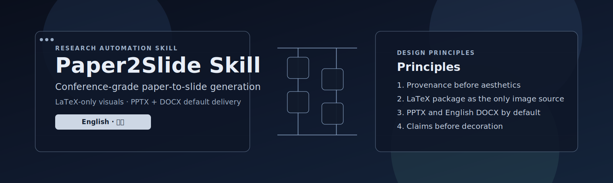

<p align="center">
  
</p>

<h2 align="center"><b>Conference-Grade Paper-to-Slide Generation for AI Research</b></h2>

<p align="center">
  <i>Turn AI papers into polished conference slides — with LaTeX-only visuals, default PPTX + English DOCX delivery, and clean AI conference style.</i>
</p>

<p align="center">
  <a href="#quick-start"></a>
  <a href="docs/i18n/README_ZH.md"></a>
  <a href="LICENSE"></a>
</p>

<p align="center">
  <a href="#overview">Overview</a> ·
  <a href="#quick-start">Quick Start</a> ·
  <a href="#features">Features</a> ·
  <a href="#citation">Citation</a> ·
  <a href="#star-history">Star History</a>
</p>

---

## Overview

`ai-paper2slide-skill` is an open-source ChatGPT Skill for converting AI and scientific papers into **conference-quality slide packages**.

It is designed for papers submitted to or presented at top-tier venues such as **NeurIPS, ICML, ICLR, CVPR, ACL, KDD, WWW, AAAI, SIGIR, EMNLP, ECCV, ICCV, MICCAI**, and related AI, machine learning, and computer vision conferences.

Unlike generic document-to-slide tools, this Skill focuses on two strict production guarantees:

1. **LaTeX-only slide images**  
   Any image inserted into the slide deck must come from the user-provided LaTeX source package. The Skill does not use PDF screenshots, web images, generated images, previous-conversation images, or external substitutes.

2. **Default two-file delivery**  
   Every full paper-to-slide run returns at least two user-facing files by default: a `.pptx` slide deck and a `.docx` English per-slide speaker script.

---

## Quick Start

> [!IMPORTANT]
> Provide the original LaTeX source package first if you want source-grounded figures in the slides.
>
> ```text
> Upload the LaTeX source package, and I will generate a conference-style PPTX deck plus an English DOCX speaker script.
> ```

### Recommended input

1. **Original LaTeX source package**  
   Supported formats: `.zip`, `.tar`, `.tar.gz`

2. **Compiled paper PDF**  
   Used for text cross-checking, section order, and final paper layout reference.

### Typical output

- `paper2slide_deck.pptx`
- `paper2slide_speaker_script.docx`
- `visual_source_manifest.json`
- `paper2slide_quality_report.md`

---

## Features

### LaTeX-only visual provenance

The Skill prioritizes the original LaTeX source package and scans it for:

- `\includegraphics` paths
- figure and table environments
- captions
- labels
- surrounding explanatory text
- architecture and method diagrams
- experimental result tables
- ablation and qualitative visualizations

Only visual assets found inside the user-provided LaTeX package are eligible for slide images.

### Default PPTX + English DOCX output

For every full paper-to-slide request, the Skill produces by default:

| Output File | Required | Description |
|---|---:|---|
| `paper2slide_deck.pptx` | Yes | A 16:9 PowerPoint presentation for the paper |
| `paper2slide_speaker_script.docx` | Yes | English per-slide speaking script, approximately 10 minutes total by default |
| `visual_source_manifest.json` | Recommended | Source trace of figures and tables from the LaTeX package |
| `paper2slide_quality_report.md` | Recommended | Checks for LaTeX-only image compliance, visual-source accuracy, slide readability, and script timing |

### Conference-ready slide design

The Skill guides ChatGPT to create a clean, presentation-ready `.pptx` deck with:

- 16:9 widescreen layout
- claim-based slide titles
- sparse and readable text
- source-grounded architecture and result visuals
- strong method storytelling
- clear experiment and ablation slides
- final takeaway and impact slide

### Configurable presentation language

The default speaker script is **English**. Users may still request different language modes for slide text, notes, or additional scripts:

| Mode | Description |
|---|---|
| `English` | Default mode for international AI conference talks |
| `Chinese` | Suitable for Chinese group meetings, thesis defenses, and internal research reports |
| `Bilingual` | English slide titles with Chinese explanations, or Chinese slides with English technical terms |
| `Custom language` | Any user-specified language depending on the venue or audience |

---

## Example Requests

### International conference talk

```text
Convert this LaTeX paper package into a 10-minute NeurIPS-style presentation.

Please create:
1. A 16:9 PowerPoint slide deck.
2. A Word document with the English per-slide speaking script.
3. A visual source manifest for all architecture figures and experimental result tables.
4. A quality report checking LaTeX-only image compliance, figure/table placement, and script timing.

Only use images that are included in the provided LaTeX package.
```

### Chinese group meeting

```text
请将这篇论文转换为一个 10 分钟中文组会汇报。

请生成：
1. 中文 PPT。
2. 默认英文逐页演讲稿 Word 文档。
3. 可选中文逐页演讲稿 Word 文档。
4. 图表来源 manifest 和质量报告。

Slide 中的所有图片必须只来自我上传的 LaTeX 源文件包。
```

---

## Included Helper Scripts

### `scripts/inspect_latex_assets.py`

Scans a LaTeX project or archive and creates a visual source manifest.

```bash
python scripts/inspect_latex_assets.py paper_source.zip \
  --output visual_source_manifest.json
```

### `scripts/validate_visual_sources.py`

Checks whether a slide visual map only references valid figure and table IDs from the manifest.

```bash
python scripts/validate_visual_sources.py \
  visual_source_manifest.json \
  slide_visual_map.json \
  --strict-latex-images \
  --output paper2slide_quality_report.md
```

---

## Suggested 10-Minute Talk Structure

| Section | Suggested Time | Purpose |
|---|---:|---|
| Title and motivation | 0.5-1 min | Introduce the problem and why it matters |
| Key challenge | 1 min | Explain the technical gap |
| Main idea | 1 min | Present the core insight |
| Method overview | 2 min | Explain the model architecture and pipeline |
| Main results | 2 min | Show quantitative improvements |
| Ablation and analysis | 1-1.5 min | Validate design choices |
| Qualitative examples | 1 min | Provide intuitive evidence, only if source assets exist |
| Conclusion | 0.5 min | Summarize contributions and impact |

---

## Skill Structure

```text
ai-paper2slide-skill/
├── README.md
├── docs/
│   └── i18n/
│       └── README_ZH.md
├── LICENSE
├── assets/
│   └── README.md
├── references/
│   ├── ai_conference_style_guide.md
│   ├── latex_visual_localization.md
│   ├── quality_checklist.md
│   └── speaker_script_guide.md
└── scripts/
    ├── inspect_latex_assets.py
    └── validate_visual_sources.py
```

---

## Design Principles

### 1. Provenance before aesthetics

The Skill verifies where every slide image comes from before designing the slide around it.

### 2. LaTeX package as the only image source

If an image is not in the user-provided LaTeX source package, it does not go into the deck.

### 3. PPTX and English DOCX by default

A complete run should always return the PowerPoint deck and the English per-slide speaker script.

### 4. Claims before decoration

Each slide should communicate one research claim, supported by one source-grounded visual or concise evidence.

### 5. Conference realism

The deck should look like a polished AI conference presentation, not a generic corporate template.

---

## Limitations

- The Skill works best when the LaTeX source package is complete and well-organized.
- PDF-only workflows cannot provide paper images under the default strict image policy.
- Complex TikZ figures, rasterized tables, or missing assets may require manual checking.
- The Skill provides a workflow and helper scripts; final artifact generation depends on the ChatGPT environment and available document/slide tools.

---

## Roadmap

Potential future improvements include:

- stricter LaTeX asset provenance checking
- better table-to-slide summarization
- built-in PPTX template themes
- venue-specific slide styles
- automatic timing calibration from generated scripts
- poster-to-slide conversion
- multilingual supplemental speaker scripts
- bilingual slide templates
- integration with open-source presentation agents

---

## Contributing

Contributions are welcome.

Useful contribution areas include:

- better LaTeX parsing
- improved slide quality checks
- additional conference style guides
- PPTX template assets that do not include external images
- evaluation examples
- multilingual documentation
- support for more paper formats

Please open an issue or pull request with a clear description of the proposed improvement.

---

## Citation

If this Skill helps your research presentation workflow, please consider citing or linking to the repository.

```bibtex
@misc{ai-paper2slide-skill,
  title        = {AI Paper2Slide Skill: Conference-Grade Paper-to-Slide Generation for AI Research},
  author       = {Zhixiang Lu},
  year         = {2026},
  howpublished = {\url{https://github.com/Leo1998-Lu/ai-paper2slide-skill}},
  note         = {Open-source ChatGPT Skill for LaTeX-only, conference-style paper-to-slide generation.}
}
```

---

## Star History

<p align="center">
  
</p>
